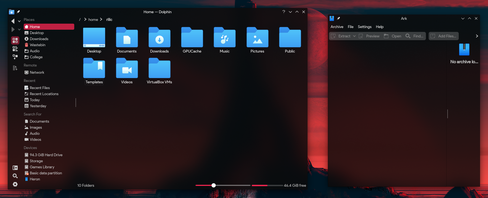

# Darkfrost-kv

My kvantum theme for KDE. Based on [Stardust-kv](https://gitlab.com/skylineone044/stardust), which is based on [FlatBlur](https://github.com/Davide-sd/FlatBlur), which is based on [Akava-Kv](https://github.com/Akava-Design/Akava-Kv). 

Goes well with the [Nilium](https://www.pling.com/p/1226329) KDE themes!